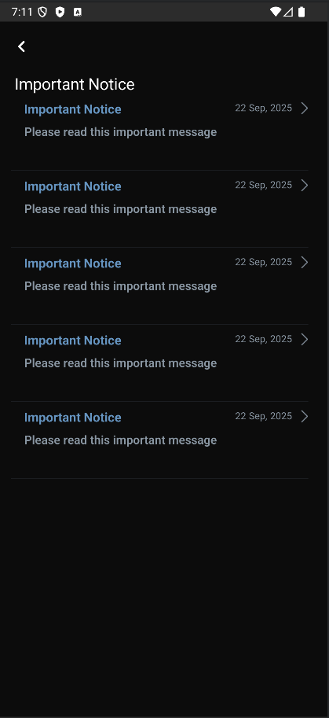
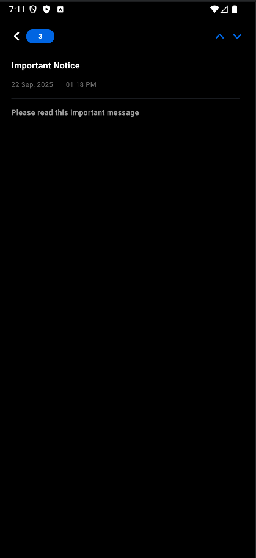

# InboxKit-Android 📬

[](https://jitpack.io/#ControlKit/InboxKit-Android)
[](https://android-arsenal.com/api?level=26)
[](LICENSE)
[](https://kotlinlang.org/)

A powerful and customizable Android library for displaying inbox-style notifications and messages using Jetpack Compose. InboxKit provides a modern, flexible solution for managing user notifications with beautiful UI components and extensive customization options.

## ✨ Features

- 🎨 **Modern UI**: Built with Jetpack Compose for beautiful, responsive interfaces
- 🔧 **Highly Customizable**: Extensive configuration options for colors, styles, and layouts
- 📱 **Multiple Styles**: Support for different view styles (FullScreen, Popover)
- 🔄 **State Management**: Robust state management with ViewModel and StateFlow
- 🌐 **Network Integration**: Built-in API integration with Retrofit
- 💾 **Local Storage**: Automatic local caching with DataStore
- 🛡️ **Error Handling**: Comprehensive error handling and retry mechanisms
- 🧪 **Well Tested**: Extensive unit and integration tests
- 📊 **Analytics Ready**: Built-in action tracking and analytics support

## 📸 Screenshots

### FullScreen Style


### Detail Page


## 🚀 Installation

### Step 1: Add JitPack repository

Add the JitPack repository to your project's `build.gradle.kts` (project level):

```kotlin
allprojects {
    repositories {
        google()
        mavenCentral()
        maven { url = uri("https://jitpack.io") }
    }
}
```

### Step 2: Add dependency

Add the following to your app's `build.gradle.kts`:

```kotlin
dependencies {
    implementation("com.github.ControlKit:InboxKit-Android:0.0.1")
}
```

### Alternative: Using version catalog

Add to your `libs.versions.toml`:

```toml
[versions]
inboxkit = "0.0.1"

[libraries]
inboxkit = { module = "com.github.ControlKit:InboxKit-Android", version.ref = "inboxkit" }
```

Then use in your `build.gradle.kts`:

```kotlin
dependencies {
    implementation(libs.inboxkit)
}
```

### Required Dependencies

Make sure you have the following dependencies in your project:

```kotlin
dependencies {
    // Jetpack Compose
    implementation("androidx.compose.ui:ui:1.9.1")
    implementation("androidx.compose.material3:material3:1.9.1")
    implementation("androidx.activity:activity-compose:1.11.0")
    implementation("androidx.lifecycle:lifecycle-viewmodel-compose:2.9.4")
    
    // Network
    implementation("com.squareup.retrofit2:retrofit:3.0.0")
    implementation("com.squareup.okhttp3:okhttp:5.1.0")
    implementation("com.squareup.retrofit2:converter-gson:3.0.0")
    
    // Image Loading
    implementation("io.coil-kt:coil-compose:2.7.0")
    
    // Data Storage
    implementation("androidx.datastore:datastore-preferences:1.1.7")
    implementation("androidx.security:security-crypto:1.1.0")
}
```

## 📖 Quick Start

### 1. Basic Setup

```kotlin
import com.sepanta.controlkit.inboxviewkit.InboxViewKit
import com.sepanta.controlkit.inboxviewkit.inboxViewKitHost
import com.sepanta.controlkit.inboxviewkit.config.InboxViewServiceConfig
import com.sepanta.controlkit.inboxviewkit.view.config.InboxViewConfig
import com.inboxview.view.config.InboxViewStyle

class MainActivity : ComponentActivity() {
    override fun onCreate(savedInstanceState: Bundle?) {
        super.onCreate(savedInstanceState)
        setContent {
            val inboxViewKit = inboxViewKitHost(
                config = InboxViewServiceConfig(
                    appId = "your-app-id",
                    version = "1.0.0",
                    viewConfig = InboxViewConfig(
                        viewStyle = InboxViewStyle.FullScreen1
                    )
                ),
                onDismiss = {
                    // Handle dismiss action
                }
            )
            
            inboxViewKit.showView()
        }
    }
}
```

### 2. Configuration

#### Service Configuration

```kotlin
val serviceConfig = InboxViewServiceConfig(
    appId = "your-unique-app-id",
    version = "1.0.0",
    deviceId = "optional-device-id", // Auto-generated if not provided
    lang = "en", // Language code
    timeOut = 5000L, // Network timeout in milliseconds
    timeRetryThreadSleep = 1000L, // Retry delay
    maxRetry = 5, // Maximum retry attempts
    viewConfig = InboxViewConfig(
        viewStyle = InboxViewStyle.FullScreen1
    )
)
```

#### View Configuration

```kotlin
val viewConfig = InboxViewConfig(
    viewStyle = InboxViewStyle.FullScreen1,
    
    // Header Configuration
    headerTitle = "My Inbox",
    headerTitleColor = Color.Black,
    headerTitleTextStyle = MaterialTheme.typography.headlineMedium,
    
    // Popup Configuration
    popupViewBackGroundColor = Color.White,
    popupViewCornerRadius = 16.dp,
    
    // Item Configuration
    inboxItemHeight = 96.dp,
    inboxItemTitleTextStyle = MaterialTheme.typography.bodyLarge,
    inboxItemSubjectTextStyle = MaterialTheme.typography.bodyMedium,
    inboxItemDateTextStyle = MaterialTheme.typography.bodySmall,
    
    // Search Box Configuration
    searchBoxColor = Color.Gray.copy(alpha = 0.1f),
    searchBoxCornerRadius = RoundedCornerShape(20.dp),
    
    // Button Configuration
    backButtonColor = Color.Black,
    nextButtonColor = Color.Blue,
    previousButtonColor = Color.Gray
)
```

## 🎨 Customization

### Custom Views

You can provide custom views for any component:

```kotlin
val customConfig = InboxViewConfig(
    // Custom Header
    headerTitleView = { title ->
        Text(
            text = title,
            style = MaterialTheme.typography.headlineLarge,
            color = Color.Primary,
            modifier = Modifier.padding(16.dp)
        )
    },
    
    // Custom Inbox Item
    inboxItemView = { model, onClick ->
        Card(
            modifier = Modifier
                .fillMaxWidth()
                .clickable { onClick() }
                .padding(8.dp),
            elevation = CardDefaults.cardElevation(defaultElevation = 4.dp)
        ) {
            Column(
                modifier = Modifier.padding(16.dp)
            ) {
                Text(
                    text = model.title,
                    style = MaterialTheme.typography.titleMedium,
                    fontWeight = FontWeight.Bold
                )
                Spacer(modifier = Modifier.height(4.dp))
                Text(
                    text = model.description,
                    style = MaterialTheme.typography.bodyMedium,
                    color = Color.Gray
                )
                Spacer(modifier = Modifier.height(8.dp))
                Text(
                    text = model.date,
                    style = MaterialTheme.typography.bodySmall,
                    color = Color.Gray
                )
            }
        }
    },
    
    // Custom Back Button
    backButtonView = { onClick ->
        IconButton(onClick = onClick) {
            Icon(
                imageVector = Icons.Default.ArrowBack,
                contentDescription = "Back",
                tint = Color.Black
            )
        }
    }
)
```

### Custom Modifiers

```kotlin
val configWithModifiers = InboxViewConfig(
    // Custom Layout Modifiers
    popupViewLayoutModifier = Modifier
        .fillMaxSize()
        .padding(16.dp),
    
    headerLayoutModifier = Modifier
        .fillMaxWidth()
        .padding(horizontal = 16.dp, vertical = 8.dp),
    
    inboxItemColumnLayoutModifier = Modifier
        .fillMaxWidth()
        .padding(horizontal = 16.dp),
    
    // Custom Search Box
    searchBoxLayoutModifier = Modifier
        .fillMaxWidth()
        .padding(16.dp)
        .height(48.dp),
    
    textFieldTextFieldModifier = Modifier
        .fillMaxWidth()
        .padding(horizontal = 8.dp)
)
```

## 🔧 Advanced Usage

### State Management

```kotlin
val inboxViewKit = inboxViewKitHost(
    config = serviceConfig,
    onDismiss = {
        // Handle dismiss
    },
    onState = { state ->
        when (state) {
            is InboxViewState.Initial -> {
                // Initial state
            }
            is InboxViewState.ShowData -> {
                // Data loaded successfully
            }
            is InboxViewState.NoData -> {
                // No data available
            }
            is InboxViewState.Error -> {
                // Handle error
                Log.e("InboxKit", "Error: ${state.data}")
            }
        }
    }
)
```

### Manual Control

```kotlin
// Get the ViewModel for manual control
val viewModel = inboxViewKit.viewModel

// Show the inbox
inboxViewKit.showView()

// Navigate programmatically
viewModel.next()
viewModel.previous()

// Send custom actions
viewModel.sendAction("CUSTOM_ACTION")

// Check current state
val currentState = viewModel.state.value
val currentIndex = viewModel.currentIndex.value
```

### API Configuration

Create a `local.properties` file in your project root:

```properties
API_URL=https://your-api-endpoint.com/api/inbox
```

Or configure programmatically:

```kotlin
val serviceConfig = InboxViewServiceConfig(
    appId = "your-app-id",
    version = "1.0.0",
    // API URL will be read from local.properties
    // or use default: https://example.com/api/inbox-view
)
```

## 📊 Data Model

### InboxViewResponse

```kotlin
data class InboxViewResponse(
    val id: String?,
    val version: String?,
    val title: String?,
    val description: String?,
    val iconUrl: String?,
    val linkUrl: String?,
    val sdkVersion: String?,
    val minimumVersion: String?,
    val maximumVersion: String?,
    val created_at: String?,
    val time: String?,
    val date: String?
)
```

### API Endpoints

The library expects the following API structure:

#### GET /api/inbox-view
```json
{
  "data": [
    {
      "id": "unique-id",
      "title": "Notification Title",
      "description": "Notification description",
      "date": "2024-01-15",
      "time": "14:30",
      "iconUrl": "https://example.com/icon.png",
      "linkUrl": "https://example.com/link"
    }
  ]
}
```

#### POST /api/inbox-view/{id}
```json
{
  "appId": "your-app-id",
  "version": "1.0.0",
  "deviceId": "device-id",
  "sdkVersion": "0.0.1",
  "action": "VIEW" // or "CLICK", "DISMISS", etc.
}
```

## 🎯 View Styles

### FullScreen1
- Full-screen dialog with header and list
- Navigation between items
- Search functionality
- Customizable colors and layouts

### Popover1 (Coming Soon)
- Compact popover style
- Minimal footprint
- Quick access to notifications

## 🧪 Testing

The library includes comprehensive testing:

```kotlin
// Unit Tests
testImplementation("junit:junit:4.13.2")
testImplementation("io.mockk:mockk:1.14.5")
testImplementation("app.cash.turbine:turbine:1.2.1")
testImplementation("org.jetbrains.kotlinx:kotlinx-coroutines-test:1.10.2")

// Integration Tests
androidTestImplementation("androidx.test.ext:junit:1.3.0")
androidTestImplementation("androidx.test.espresso:espresso-core:3.7.0")
```

## 🔒 Security

- Data encryption using Android Security Crypto
- Secure local storage with DataStore
- Network security with certificate pinning support
- Input validation and sanitization

## 📱 Requirements

- **Minimum SDK**: 26 (Android 8.0)
- **Target SDK**: 36 (Android 14)
- **Kotlin**: 2.2.20+
- **Compose**: 1.9.1+

## 🤝 Contributing

We welcome contributions! Please see our [Contributing Guidelines](CONTRIBUTING.md) for details.

## 📄 License

This project is licensed under the MIT License - see the [LICENSE](LICENSE) file for details.

Copyright (c) 2024 ControlKit

## 🆘 Support

- 📧 Email: support@controlkit.com
- 🐛 Issues: [GitHub Issues](https://github.com/ControlKit/InboxKit-Android/issues)
- 📖 Documentation: [Wiki](https://github.com/ControlKit/InboxKit-Android/wiki)
- 📦 JitPack: [Download](https://jitpack.io/#ControlKit/InboxKit-Android)

## 🙏 Acknowledgments

- Jetpack Compose team for the amazing UI framework
- Square for Retrofit and OkHttp
- Coil team for image loading
- All contributors and users

---

Made with ❤️ by the ControlKit team